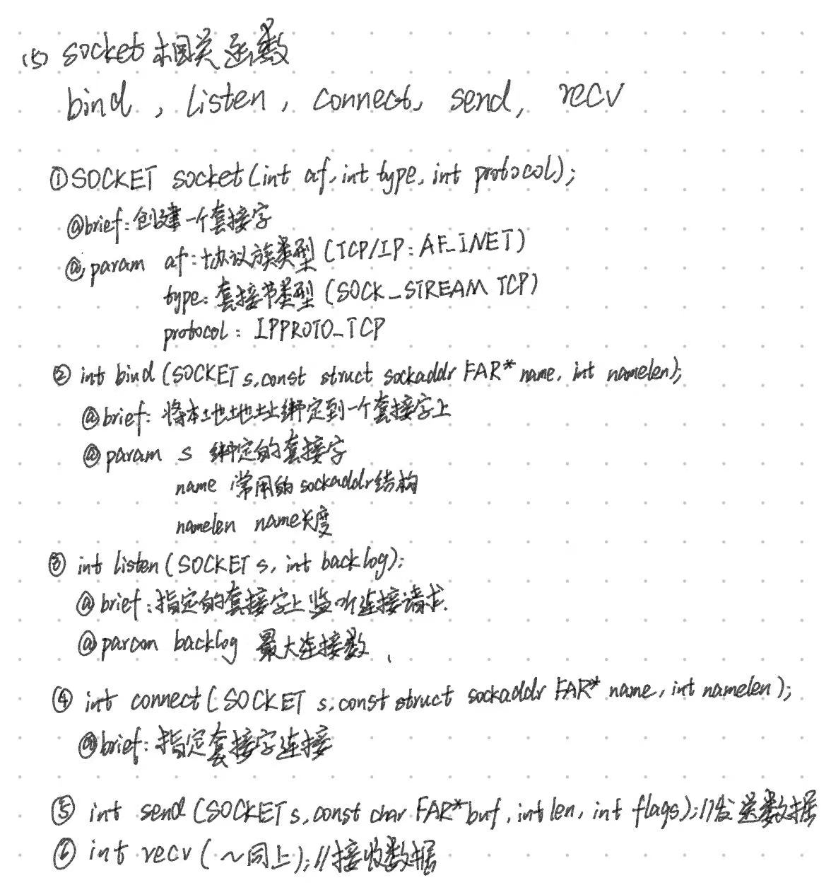

# C++聊天室架构
## 1.架构设计:
客户端层, 网关接入层, 路由层, 业务层\
协议: TCP, IPv4\
服务器(IP:162.14.74.178), guest用户(不可编辑)密码: helloworld\
编辑器: 客户端:vs2022, 服务器端:vscode + vim\
编译器: 客户端:MSVC, 服务器端:gcc/g++

## 2.难点突破
数据安全(SHA-256???需要进一步学习探究)
## 3.技术点
1. 网络编程, 
   [多线程](https://www.bilibili.com/video/BV1VJ411M7WR?p=62),
   [epoll](https://blog.csdn.net/beilizhang/article/details/124213302?ops_request_misc=%257B%2522request%255Fid%2522%253A%2522167996705516800226570053%2522%252C%2522scm%2522%253A%252220140713.130102334..%2522%257D&request_id=167996705516800226570053&biz_id=0&utm_medium=distribute.pc_search_result.none-task-blog-2~all~top_positive~default-2-124213302-null-null.142^v76^pc_new_rank,201^v4^add_ask,239^v2^insert_chatgpt&utm_term=epoll&spm=1018.2226.3001.4187)
2. [套接字类型](https://blog.csdn.net/baidu_15547923/article/details/90173675?ops_request_misc=%257B%2522request%255Fid%2522%253A%2522167996677616782425185762%2522%252C%2522scm%2522%253A%252220140713.130102334..%2522%257D&request_id=167996677616782425185762&biz_id=0&utm_medium=distribute.pc_search_result.none-task-blog-2~all~sobaiduend~default-2-90173675-null-null.142^v76^pc_new_rank,201^v4^add_ask,239^v2^insert_chatgpt&utm_term=%E5%A5%97%E6%8E%A5%E5%AD%97%E7%B1%BB%E5%9E%8B&spm=1018.2226.3001.4187)\
        1.流套接字TCP\
        2.数据报套接字UDP\
        3.原始套接字IP
3. [工作流程(C/S)](https://blog.csdn.net/zutsoft/article/details/12659031?ops_request_misc=%257B%2522request%255Fid%2522%253A%2522167996688316782425113744%2522%252C%2522scm%2522%253A%252220140713.130102334..%2522%257D&request_id=167996688316782425113744&biz_id=0&utm_medium=distribute.pc_search_result.none-task-blog-2~all~sobaiduend~default-1-12659031-null-null.142^v76^pc_new_rank,201^v4^add_ask,239^v2^insert_chatgpt&utm_term=C%2FS%E5%B7%A5%E4%BD%9C%E6%B5%81%E7%A8%8B&spm=1018.2226.3001.4187)
        1. 服务器监听 ---> 等待链接, 实时监控网络状态\
        2. 客户端请求 ---> 提出连接请求
                          链接目标: 服务器套接字\
        3. 链接确认 ---> 当服务器套接字监听到链接请求时, 
                        响应并建立新线程与链接, 同时监听其他客户端
4. [网络字节序(不重要)](https://blog.csdn.net/u013178472/article/details/108397297?ops_request_misc=%257B%2522request%255Fid%2522%253A%2522167996691716800184139750%2522%252C%2522scm%2522%253A%252220140713.130102334..%2522%257D&request_id=167996691716800184139750&biz_id=0&utm_medium=distribute.pc_search_result.none-task-blog-2~all~sobaiduend~default-2-108397297-null-null.142^v76^pc_new_rank,201^v4^add_ask,239^v2^insert_chatgpt&utm_term=%E7%BD%91%E7%BB%9C%E5%AD%97%E8%8A%82%E5%BA%8F&spm=1018.2226.3001.4187)
5. [socket函数(关键)](https://blog.csdn.net/weixin_43850974/article/details/118912910?ops_request_misc=%257B%2522request%255Fid%2522%253A%2522167996671616800182197044%2522%252C%2522scm%2522%253A%252220140713.130102334..%2522%257D&request_id=167996671616800182197044&biz_id=0&utm_medium=distribute.pc_search_result.none-task-blog-2~all~top_click~default-2-118912910-null-null.142^v76^pc_new_rank,201^v4^add_ask,239^v2^insert_chatgpt&utm_term=socket%E5%87%BD%E6%95%B0&spm=1018.2226.3001.4187)


## 4.架构
### 后端
* 服务器端(linux下)\
技能点: C++, linux( 基础命令, vim, g++, gdb, ...), 网络编程, epoll\
建议人数: 1\
估计时间: 2~4天
```cpp {.line-numbers}
//global v
const int MAX_CONNECT 100

/*^
 *@ brief 设计Client类用于保存客户端信息
 */
class Client{
//注意面向对象的原则
private:
        int sockfd;
        std::string name;
public:
        Client(int fd, std::string user_name):
                sockfd(fd), name(user_name){
                        //必要的其他初始化操作
        };
        ~Client(){
                //必要的析构操作
        };
        friend &std::ostream operator<<(&std::ostream os, Client const clt);
        //等其他操作
        
};

void chat_func{
        //创建epoll实例(记得判断是否成功)
        //创建监听的socket(记得判断)
        //创建监听的socket, 并sockaddr绑定ip
        //开始监听客户端

        //将监听socket加入epoll,判断
        //使用std::map保存客户信息
        while(1){
                if(fd == sockfd){
                //epoll数组, 循环监听, 判断

                //判断收到fd消息, 建立链接, 接收客户端信息, 判断
                //将客户端的socket加入epoll;
                //检测消息, 判断

                //Client保存客户端消息
                }else{//接收到客户端消息
                        //case 0 离开连接: 删除用户链接
                        //default 接收消息, 发送给其他所有客户端 
                }
        }
        //关闭epoll实例
        //...
}

```
* [客户端](https://www.bilibili.com/video/BV1Q24y1v7Wa?p=4)\
技能点: C++, 网络编程(socket), thread多线程\
建议人数: 1\
估计时间: 3~5天
```cpp {.line-numbers}

void chat_func(){
//win初始化socket环境, Ctrl C V

//创建socket
//绑定端口服务器(IP:162.14.74.178)

//连接服务器(判断, 如果成功connect_sound())
/* 多线程实现循环发收消息
 * if 收到消息 -> receive_sound()
 * if 发送成功 -> send_sound()
 */

//等待线程结束
}
```
### 前端
* 客户端\
技能点: C/C++, easyx/qt, 美术
要求: 高端, 大气, 上档次, 越高调越好
```cpp
//音效, 具体声音可更改, 记得用完要清除
connect_sound()//~~~
receive_message()//咚咚咚~~~
send_sound()//咻咻咻~~~
login_sound()//bingo~~~
wrongpw_sound()//嗡嗡嗡~~~
//====================================//
//ui设计, 一定要足够秀
//
```